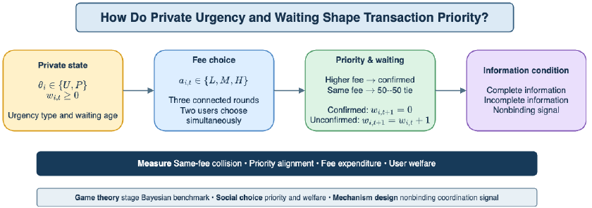
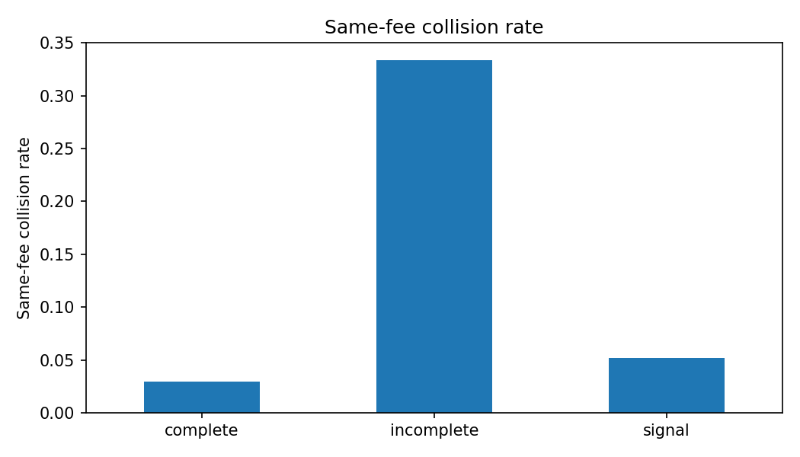
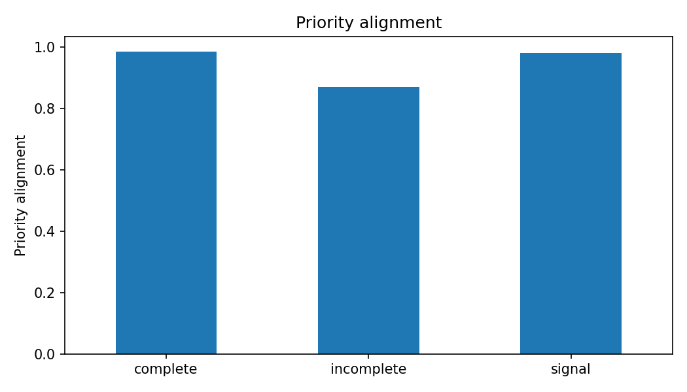
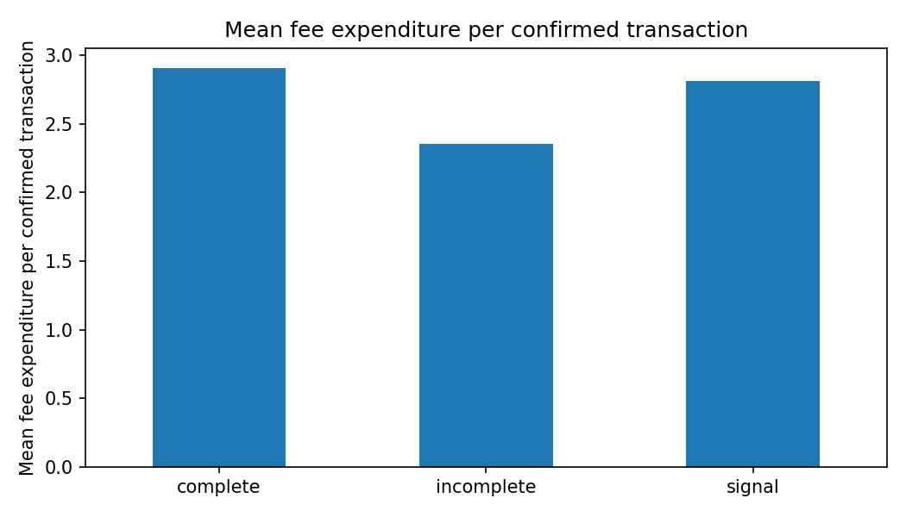
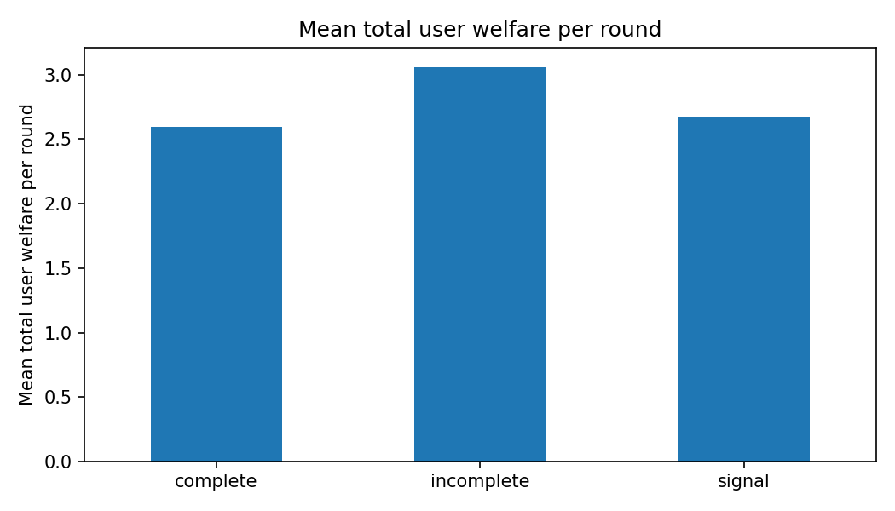

# Strategic Fee Choice and Transaction-Priority Allocation under Incomplete Information

**Two users, three connected rounds, and Low / Medium / High fees.**

[Open updated Colab](https://colab.research.google.com/drive/1E5NDNUU62rHPwp9UCG9oEHXplz3PG9EJ?usp=sharing) · [Hugging Face behavioral interface](https://huggingface.co/spaces/dku-comsci-econ206-2026/SubmitOrWait) · [Proposal PDF](paper/Strategic_Fee_Level_Choice_Proposal.pdf)



*Research design from Figure 1 of the revised proposal.*

## Research question and model

How do private urgency and accumulated waiting affect transaction-priority allocation, and can nonbinding recommendations improve allocation? Each user draws a fixed private Urgent or Patient type, then simultaneously chooses L, M, or H in each of three rounds. Exactly one user is confirmed per round: the higher fee wins, and equal fees use a seeded 50/50 tie-break. Confirmation resets waiting to zero; otherwise waiting increases by one. Users can be confirmed again in later rounds.

The confirmed user's utility is `value − fee`. The unconfirmed user's utility is `−delay × updated_wait`; that user does not pay a fee. Total user welfare is the sum of both utilities per round. Fees are treated as user costs; fee-recipient revenue is not added to this welfare measure. This is a stylized model motivated by Algorand, not a validated description of its live fee market.

## Inputs

| Input | Baseline |
|---|---|
| Fee menu | L = 1, M = 2, H = 3 |
| Urgent type | confirmation value 8; delay cost 2 |
| Patient type | confirmation value 5; delay cost 1 |
| Type sampling | independent users; Pr(Urgent) = 0.60; fixed type within session |
| Initial waiting / horizon | both zero / 3 connected rounds |
| Tremble | 0.03 in every condition; uniformly chooses a different action |
| Signal following | independent decision per user; probability 0.85 |
| Main simulation | 100,000 sessions per condition; 300,000 rounds per condition |
| RNG | Python `random.Random`; base seed 206 |
| Condition seeds | complete 206; incomplete 1,000,206; signal 2,000,206 |
| Sensitivity | 11 probabilities from 0 to 1; 30,000 sessions each; seed `206 + int(rho * 10000) + 2000000` |
| External data / API keys | none; all observations are generated by the model |

The stage benchmark checks that H is a strict best response to an opponent playing H for both types and waiting states 0, 1, and 2. Thus (H,H) is a stage Bayesian Nash benchmark. This is not a computed equilibrium of the entire dynamic game.

The Monte Carlo simulation uses a separate comparison policy: Urgent chooses M at waiting 0 and H thereafter; Patient chooses L at 0, M at 1, and H at 2 or more. These are specified behavioral rules, not equilibrium strategies.

- **Complete information:** a coordinator uses both users' types and waiting states to recommend differentiated fees. Recommendations are followed before tremble. This is a coordination benchmark, not a welfare-maximizing planner.
- **Incomplete information:** each user uses its own type and waiting with the comparison policy.
- **Incomplete information + signal:** the coordinator scores each user as `2 × is_Urgent + waiting`, selects the higher score (random tie-break), recommends H to an Urgent or waiting priority user, otherwise M, and recommends L to the other. Each user follows with probability 0.85, otherwise uses the comparison policy. The opponent's type remains private to the user; the coordinator has access to both states.

## Actual reproduced output

These results come from the updated Colab notebook's algorithm and are independently rerun locally. [Full-precision condition CSV](results/condition_summary.csv) · [Round-level CSV](results/round_summary.csv) · [Compliance sensitivity CSV](results/signal_sensitivity.csv) · [Executed notebook](notebooks/PS2_Dynamic_Fee_Choice.executed.ipynb).

| Condition | Same-fee collision | Priority alignment | Urgent confirmation | Fee expenditure | Waiting after round | User welfare / round |
|---|---:|---:|---:|---:|---:|---:|
| Complete information | 2.92% | 98.48% | 82.76% | 2.9051 | 0.6591 | 2.5982 |
| Incomplete information | 33.36% | 87.11% | 66.39% | 2.3521 | 0.5479 | 3.0570 |
| Incomplete + signal | 5.20% | 97.99% | 81.25% | 2.8123 | 0.6497 | 2.6780 |

Priority alignment is evaluated only when priority scores differ. Urgent confirmation is evaluated only when the two types differ. Other columns average all rounds; waiting averages both users. Fee expenditure is the confirmed user's fee per round, also the fee per confirmed transaction. A same-fee collision still confirms one user, so it does not mean that both transactions fail.

Relative to incomplete information, the signal reduces collisions by **28.16 percentage points**, improves alignment by **10.88 points**, and raises urgent confirmation by **14.85 points**. At the same time, fee expenditure rises by **0.4602** and welfare falls by **0.3790** per round. Waiting rises by **0.1018**. Better priority allocation therefore comes with higher fee and delay costs in this calibration; it does not automatically increase user welfare. These are simulation comparisons under specified policies, not estimated human treatment effects.






Round-level outputs show why the horizon matters: incomplete-information collision rates are **50.46%, 45.36%, and 4.25%** in rounds 1–3; signal rates are **5.90%, 3.90%, and 5.80%**. Accumulated waiting changes the comparison policy, so a static one-round model cannot reproduce this pattern.

In the sensitivity simulation, moving signal following from 0 to 1 lowers collisions from **33.32% to 3.02%** and raises priority alignment from **87.15% to 98.54%**. Fee expenditure rises from **2.3507 to 2.9059**, while welfare falls from **3.0569 to 2.6081**. These endpoints use separate Monte Carlo seeds from the baseline; small numerical differences are expected.

**Outputs corresponding to the poster:** the table and linked plots above provide the poster's quantitative comparison and its allocation–cost interpretation, as confirmed by the authors. The CSVs retain the full-precision values behind the displayed rounding.

## Tested version and run steps

**Tested commit:** `726511c24480e1d95ed4a611672a214334679625`. Running `python scripts/reproduce.py` at this commit reproduced all eighteen aggregate values from the updated notebook, with 900,000 main simulation rows and eleven figures. The inputs, seeds, environment, and output hashes are recorded in [the run manifest](results/run_manifest.json).

Test environment: Python 3.12.2, NumPy 2.4.4, pandas 3.0.2, Matplotlib 3.10.8, IPython 9.15.0. See [run manifest](results/run_manifest.json) for the actual runtime version, source hash, seeds, checks, and CSV hashes. Dependencies are pinned in `requirements.txt`; use Python 3.12 for this tested environment.

From the repository root:

```bash
python3.12 -m venv .venv
source .venv/bin/activate
python -m pip install -r requirements.txt
python scripts/reproduce.py
```

The script executes the unchanged Python code cells of `notebooks/PS2_Dynamic_Fee_Choice.ipynb` in order, exports four CSVs and eleven PNGs to `results/`, saves the executed notebook, and compares all eighteen aggregate values against the supplied notebook's saved results with absolute tolerance 0.000051. A successful run ends with `PASS: saved notebook aggregates reproduced; 900,000 rows; 11 figures.` The tested path does not require a Jupyter kernel or GPU.

For Colab, open the updated link and choose **Runtime → Run all**. The notebook saves its three main CSVs in the runtime working directory; download them before ending the runtime. The GitHub copy is the fixed source for local verification; live Colab sharing and the current Hugging Face revision were not independently verified in this session.

## Repository contents and evidence limits

- `assets/fee_choice_teaser.png`: updated research-design diagram from the revised proposal.
- `notebooks/`: updated clean source and fresh executed copy.
- `scripts/reproduce.py`: full-run exporter and comparison checks.
- `results/`: actual CSVs, eleven figures, and run manifest.
- `paper/`: supplied updated proposal PDF. Its body uses the dynamic model, but some appendices still describe the earlier binary model; see [proposal corrections](docs/PROPOSAL_CORRECTIONS.md).
- `docs/`: artifact descriptions, reproduction details, and evidence status.

The old notebook generator and validation script have been removed because they recreate or require the obsolete H/L model. Old Overleaf source was removed from the active package because it does not match the supplied new PDF. The old teaser was replaced with Figure 1 from the revised proposal. The original ZIP retains that historical version. Current editable proposal source must be exported from the authors' updated Overleaf project before it can be included as current source.

No participant dataset, live Algorand validation, or causal treatment estimate is included. The Hugging Face link is a behavioral interface, not evidence of measured human compliance.

## Authors and license

Lin Zhang (`lin.zhang@dukekunshan.edu.cn`) and Zijie Wang (`zijie.wang@dukekunshan.edu.cn`). Team 7, COMSCI/ECON 206: Computational Microeconomics; instructor Professor Luyao Zhang.

Original project code and documentation: MIT. Proposal references retain their cited authors' rights.
